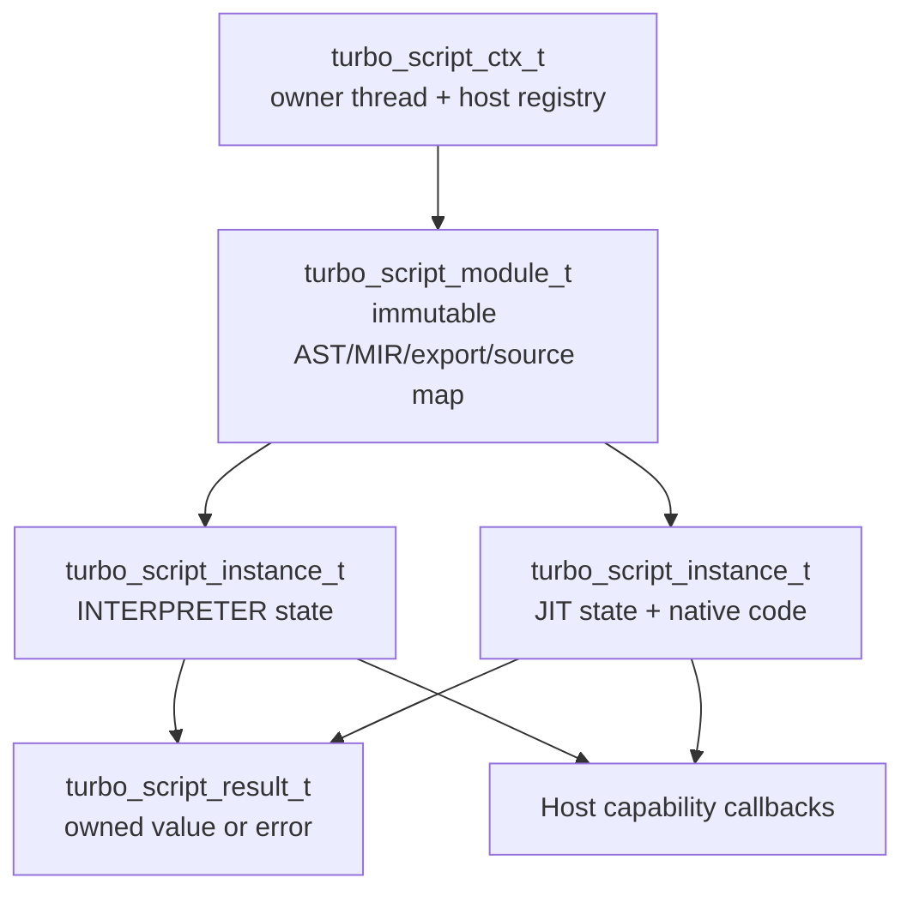
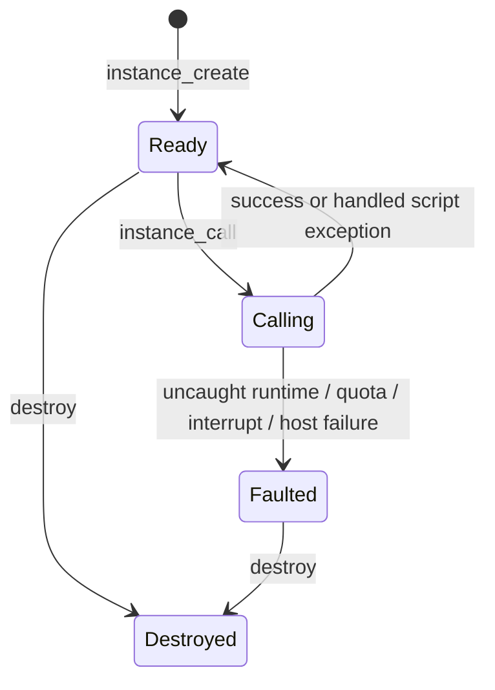

# TurboScript Stable Host Module ABI Design

- 状态：已获规格批准，进入实施计划
- 日期：2026-08-25
- 跟踪：[qigao/TurboScript#1](https://github.com/qigao/TurboScript/issues/1)
- 首个消费者：FlexUI controller adapter

## 1. 背景

FlexUI 需要在加载阶段解析具名 handler，并在运行阶段把有界事件快照传入
TurboScript，再接收 UI mutation 或 application command。当前 public API 不能提供这一
宿主契约：`turbo_script_compiled_t` 仅保留源码，`turbo_script_exec()` 会再次执行源码路径；
公开 API 没有 export query/call、backend-neutral module、mode-fixed instance、稳定 tagged
value、owned result、结构化 operation error 或统一 interrupt 语义。

TurboScript 已有 MIR interpreter 和 JIT 两种执行路径。本设计不为二者建立两套宿主 API，
而是在同一 module、export、value、error、host callback 和 limits ABI 下提供两个固定模式的
instance。FlexUI 只选择模式，不感知 exprtk/MIR 内部对象。

当前 Windows Debug 基线还有一个独立环境前置条件：`win-dev-user` 要求
`C:/projects/cpp/external/pkgs/turbohttp/debug`，本机仍安装在旧布局
`turbohttp-debug`。实施测试前必须安装或迁移匹配 profile 的 Salts package；不得在
preset 或 CMake 中增加旧路径 fallback。

## 2. 目标与非目标

### 2.1 目标

- 建立纯 C、opaque-handle、可安装的 host module ABI。
- parse/validate/lower 一次，重复调用 export 不重新解析源码。
- 同一 immutable module 可创建多个 interpreter/JIT instance。
- instance 创建时固定 execution mode，生命周期内不可切换。
- 支持 host 到 script 的具名调用，以及 script 到 host 的 capability callback。
- public value 支持 null、bool、int64、number、UTF-8 string、bounded array 和 bounded record。
- 所有操作返回稳定 status，并通过 owned result 提供结构化 error/value。
- interpreter/JIT 共享预算、interrupt、错误和 observable state 语义。
- 保持现有 `run`、`run_jit`、`compile`、`exec` 和 `ts_bind_func` 行为兼容。

### 2.2 非目标

- 不把 exprtk AST/value/env、MIR module/function、arena 或 native code pointer 暴露到 ABI。
- 不允许同一 instance 每次 call 动态切换 backend。
- 不在首版提供跨线程 instance 调用、并发 callback 或递归进入同一 instance。
- 不把异步 job pump 隐式塞入同步 call；现有 task/timer API 保持独立。
- 不在本阶段接入 FlexUI Box、EventDispatcher 或 mutation commit。
- 不以 interpreter fallback 掩盖 JIT 不支持的语义。

## 3. 候选方案与决策

### 3.1 采用：immutable module + mode-fixed instance

新增 backend-neutral module 和 backend-specific instance。旧 API 在新 ABI 完整且 contract
tests 通过后改为兼容包装。这一方案把不可变编译事实与可变运行状态分开，允许用同一 module
直接对照两个 backend。

### 3.2 不采用：扩展现有 compiled object

把源码、AST/MIR、globals、closure、JIT cache 和错误继续塞进
`turbo_script_compiled_t` 会让所有权与重复调用语义继续混合，也无法自然表达同一 module 的
双 backend instance。

### 3.3 不采用：公开两套 backend 类型

独立 `interpreter_module`/`jit_module` 会让宿主和 FlexUI adapter 维护两套分支，且不能通过
类型系统保证 value/error/host callback 语义一致。

## 4. 架构与所有权



所有权与销毁顺序：

1. `turbo_script_ctx_t` 拥有线程归属、host capability registry 与共享 runtime services。
2. `turbo_script_module_t` 由调用方销毁，但引用创建它的 context；context 必须后销毁。
3. module 拥有解析/校验结果、backend-neutral MIR、export descriptors、module name 与 source map。
4. module 不拥有 globals、closure、执行栈、call result 或 backend cache 等可变 instance 状态。
5. `turbo_script_instance_t` 引用 module；module 必须晚于其全部 instance 销毁。
6. instance 拥有 globals、closures、runtime state、backend runtime 和 export handle generation。
7. `turbo_script_result_t` 由 TurboScript allocator 创建/释放，可被同 context 的操作重复使用。
8. result 内的 value/error view 在 result reset、下一次写入或销毁前有效。

module 首版不得跨 context 使用。module 可在同一 owner thread 创建多个 instance，但 instance
之间不共享 mutable globals/closures。传给 `module_compile` 的 source/module-name view 只在调用
期间借用；成功时 module 在自身 quota 内复制诊断、source map 和后续执行所需的全部内容。

## 5. Public ABI 轮廓

### 5.1 Opaque 类型与版本

```c
#define TURBO_SCRIPT_HOST_ABI_VERSION 1u

typedef struct turbo_script_module_s turbo_script_module_t;
typedef struct turbo_script_instance_s turbo_script_instance_t;
typedef struct turbo_script_result_s turbo_script_result_t;
typedef struct turbo_script_host_result_builder_s
    turbo_script_host_result_builder_t;

typedef uint64_t turbo_script_export_handle_t;
```

handle `0` 永远无效。export handle 由 instance generation 与 export slot 派生，不是函数指针；
只能传回创建它的 instance。instance 销毁后全部 handle 失效。

新 options/limits/info struct 均以 `uint32_t struct_size` 开头并保留 reserved slots。新增 host
ABI 使用独立版本号，不改变现有 `TURBO_SCRIPT_NATIVE_ABI_VERSION == 3` 的 plugin 契约。

### 5.2 Execution mode

```c
typedef enum turbo_script_execution_mode_e {
  TURBO_SCRIPT_EXEC_INTERPRETER = 1,
  TURBO_SCRIPT_EXEC_JIT = 2
} turbo_script_execution_mode_t;
```

mode 只出现在 instance options。JIT 对 module 中某个语义不支持时，instance creation 返回
`UNSUPPORTED_BACKEND_SEMANTIC`；禁止自动创建 interpreter instance。

### 5.3 操作入口

最终 public API 至少覆盖以下能力；具体参数顺序在实施时遵循现有 C API 风格，但不得改变
这里的所有权和失败语义：

```text
result_create(ctx, out_result) -> status
result_reset(result)
result_destroy(result)

module_compile(ctx, source_view, module_options, result, out_module) -> status
module_destroy(module)

instance_create(module, instance_options, result, out_instance) -> status
instance_destroy(instance)

instance_resolve_export(instance, name_view, result, out_handle) -> status
instance_get_export_info(instance, export_handle, result, out_info) -> status
instance_call(instance, export_handle, args_view, call_options, result) -> status

context_register_host_function(ctx, descriptor, callback, user_data, result) -> status
context_unregister_host_function(ctx, name_view, result) -> status
```

创建、解析与调用入口都返回稳定 status；module、instance、handle 和 info 通过必填 out pointer
发布，call value/error 通过 result getter 取得。失败前将对象 out pointer/handle 清为无效值，且
不得发布部分 module、instance 或 call value。`result_create` 若因 OOM 失败，仅返回稳定
`OUT_OF_MEMORY` status，因为此时还没有可承载扩展诊断的 result owner。

host registry 在 module compile 前完成配置。只要 context 仍存在 module/instance 或正在 call，
注册表就不可修改，避免已经 lower 的 host callsite 与 registry 漂移。

## 6. Value 与 Result ABI

### 6.1 Borrowed value view

public value 是只读 tagged view：

```text
NULL
BOOL
INT64
NUMBER
STRING  = UTF-8 pointer + byte length
ARRAY   = value_view pointer + element count
RECORD  = {string_view key, value_view value} pointer + entry count
```

- host 输入 view 由 host 持有，只保证当前 API/callback 栈内有效。
- TurboScript 若把输入保存到 globals/closure，必须先按 instance memory quota 深拷贝。
- runtime 在执行前验证 type、pointer/count、UTF-8、最大深度、元素数和总字节数。
- 空 string/array/record 允许 null data + zero length；非零 length 必须提供非 null data。
- record key 必须为非空 UTF-8，同一层重复 key 立即返回 `DUPLICATE_RECORD_KEY`。
- input graph 必须是树；深度/总节点限制在遍历前和遍历中 checked-add，拒绝溢出。

### 6.2 Owned result

`turbo_script_result_t` 是唯一 output/error owner：

- 成功 call 保存一个 runtime-owned value，可通过 borrowed value view 读取。
- 失败保存一个 structured error，不保存部分 value。
- 新操作写入 result 前先 reset；reset/destroy 释放先前 value/error。
- result 不得在两个并发操作间共享，也不得跨 context 使用。
- host 不直接 `free()` result 内的 pointer，避免跨 DLL/CRT allocator 不匹配。

### 6.3 Host callback

新 callback ABI 接收 borrowed args、opaque result builder 和 borrowed `user_data`。callback 通过
builder 写入一个完整返回值或一个 host error；builder 实施同样的 depth/count/bytes quota。

callback 不接收 exprtk env/value，也不取得 native instance pointer。runtime 同时维护 instance
`CallingHost` guard 和 context-wide host-callback depth；即使 `user_data` 间接持有 instance，
递归调用同一或另一 instance 也返回 `REENTRANT_CALL`。首版拒绝所有 instance 嵌套调用，以保持
锁与错误传播简单。

FlexUI 使用 callback 收集 mutation/application command；callback 不直接修改 Box。call 成功
返回后由 FlexUI adapter 统一验证和提交 effect batch。

## 7. Error 与状态语义

### 7.1 Structured error

错误至少包含：

```text
status
error_code
phase: compile | instantiate | resolve | call | host_callback | interrupt
module_name
function_name
source line/column/length
message
cause_code
```

string/error storage 归 result 所有。library 不以 stdout/stderr 作为 public operation 的错误
通道；CLI/REPL 可在消费 structured error 后自行打印。

### 7.2 Instance state machine



首版不提供 in-place reset。恢复方式是从仍有效的 immutable module 创建新 instance。

### 7.3 失败矩阵

| 失败 | 是否执行脚本 | instance 是否 Faulted | 输出 |
|---|---:|---:|---|
| missing export | 否 | 否 | `NOT_FOUND` error |
| stale/wrong-instance handle | 否 | 否 | `INVALID_EXPORT_HANDLE` |
| argument/type/quota preflight | 否 | 否 | validation error |
| JIT unsupported semantic | 否；发生于 instantiate | 无 instance | instantiate error |
| handled script exception | 是 | 否 | script 定义的正常 value/error |
| uncaught runtime exception | 是 | 是 | runtime error |
| host callback failure | 是 | 是 | host error with cause |
| step/memory/stack quota | 是 | 是 | quota error |
| interrupt/deadline | 是 | 是 | interrupted error |

module compile/instance create 失败不发布半初始化 handle。module 始终可以在一个 instance fault
后创建新的 instance。

## 8. 预算与 Interrupt

预算按三个边界配置：

- module compile limits：source bytes、AST/MIR nodes、imports、exports、string bytes。
- instance limits：retained memory、stack bytes、recursion、globals/closures、result bytes。
- call limits：steps、loop iterations、host callback count、result bytes、interrupt/deadline callback。

call options 只能收紧 instance defaults，不能扩大。所有计数使用 checked arithmetic；零值不表示
无限，默认值来自显式 bounded profile。

interpreter 与 JIT 在相同 MIR safe point 检查：函数入口、循环回边、host callback 前后以及
有界批次的指令间隔。interpreter 在 dispatch 中检查；JIT 在生成代码中插入等价 guard。host
interrupt callback 必须是无阻塞、无分配、线程安全的只读判定，并且不得重入 TurboScript。

## 9. Interpreter/JIT 语义一致性

同一 module 分别创建两个 instance，并执行完全相同的 call sequence。contract suite 比较：

- export presence、name、arity 和 signature metadata。
- null/bool/int/string/array/record 的精确值。
- number 使用固定 absolute/relative tolerance，不要求 bitwise identical。
- globals、closures 和重复调用后的 observable state。
- host callback 次数、顺序、参数和返回值。
- structured error code、phase、function 和 source span。
- quota/interrupt 的 safe-point 类别和 Faulted transition。
- result/module/instance 销毁顺序与 stale handle 拒绝。

JIT contract failure 不得通过 interpreter retry 变绿。若 backend 的正常浮点差异超过约定容差，
测试必须记录表达式和两个结果，不能扩大全局容差掩盖具体问题。

## 10. 线程与 Reentrancy

- context 在创建时捕获 owner thread；module/instance/result 操作均要求该线程。
- interrupt callback 可由其他线程改变其自有 atomic flag，但 callback 本身由 owner thread 在
  safe point 调用。
- host callback 同步运行于 owner thread。
- `instance_call` 在 `Calling`/`CallingHost` 状态再次进入立即返回 `REENTRANT_CALL`。
- destroy 不能与 call 并发；窗口关闭由 host 先请求 interrupt，等待 call 返回，再按
  result -> instance -> module -> context 顺序销毁。

## 11. 兼容与迁移

### 11.1 Legacy API

以下入口保持源码和二进制兼容：

- `turbo_script_run()` / `turbo_script_run_jit()`
- `turbo_script_compile()` / `turbo_script_exec()` / `turbo_script_compiled_free()`
- `ts_bind_func()` 与现有 `exprtk_value_t` callback

新 API 未完成前只在内部 build feature 下编译，不安装 public declaration。完整 contract suite、
install-tree consumers 和 ABI review 通过后一次性公开。随后 legacy implementation 可改为新
module API 的兼容包装，但不得改变现有 stdout/REPL 或 context variable 行为。

### 11.2 ABI version

- 新 host module API 使用 `TURBO_SCRIPT_HOST_ABI_VERSION == 1`。
- 现有 plugin native ABI 保持 version 3。
- options/info/error structs 使用 `struct_size`、明确 alignment 和 reserved slots。
- enum 使用固定宽度存储约定；public header 只使用 C99/C11 可表达类型。
- symbol visibility/calling convention 继续走 `TURBO_SCRIPT_C_API`。

### 11.3 FlexUI migration

1. TurboScript 安装包先通过独立 C/C++ host consumer。
2. FlexUI 新建私有 adapter target，只在 `.cpp` 包含 `turbo_script.h`。
3. adapter compile module，创建选定模式 instance，解析所有 `EventBinding.handler`。
4. missing handler 在 load 阶段返回带 FlexUI source span 的错误，不发布 Box/controller 半状态。
5. runtime event 通过 value view 调用 stable export handle；host callbacks 只收集 effect。
6. feature 关闭时不查找、不链接、不部署 TurboScript，现有 Box 路径不变。

## 12. 实施阶段与隐藏策略

按下列顺序实现，每一阶段内部可测试，但 public header 只在第 8 阶段完整公开：

1. 拆出 module/instance ownership 和内部 state machine。
2. module 保存解析/校验/lower 产物，两个 backend 不再重新解析。
3. 实现 export descriptors、generation handle 和 repeat call。
4. 实现内部 value view、owned result 和 structured error。
5. 实现 host capability callback 与 reentrancy guard。
6. 实现 compile/instance/call limits、safe-point interrupt 和 Faulted transition。
7. 建立 interpreter/JIT contract suite，并修复全部差异。
8. 公开完整 host ABI，增加 installed-header ABI/ownership tests。
9. 把 legacy API 切到兼容 wrapper，运行全部旧测试。
10. 添加 compile/first call/steady call/interrupt benchmark，再接 FlexUI adapter。

不得提前安装声明后返回 `NOT_IMPLEMENTED`，也不得通过默认 fallback 暴露半实现功能。

## 13. 测试与验证

### 13.1 最小功能测试

- compile success/error、module name/source location。
- instance create for interpreter/JIT、unsupported backend semantic。
- export found/missing/duplicate、wrong instance/stale handle。
- zero/one/many args、所有 public value 类型和嵌套 limits。
- repeated call、globals/closure isolation、multiple instances。
- host callback success/error/quota/reentrancy。
- step/memory/stack/result quota 与 interrupt。
- destroy in every valid order；invalid order fail fast without UAF/double-free。

### 13.2 Contract 与回归

- 同一 data-driven suite 同时运行 interpreter/JIT。
- 现有 interpreter、MIR interpreter、JIT、task/timer、module tests 全部保持通过。
- ASan 检查 compile failure、instance fault、interrupt、result reuse 和 teardown。
- Debug/Release shared library 分别运行 install-tree C host 与 C++ host。
- consumer 只包含 installed `turbo_script.h`，不能访问 internal headers。

### 13.3 性能证据

记录 module compile、instance create、first call、steady call、host callback 和 interrupt latency。
重复 export call 必须证明不重新 parse/lower；稳态 benchmark 单独报告 interpreter/JIT，不以两者
平均值掩盖回归。

## 14. 状态归属与失败收场

- 编译事实源：immutable module。
- 运行事实源：单个 instance 的 globals/closures/backend state。
- 输出事实源：当前 result object；host 读取 view，不维护第二份隐式 runtime value。
- FlexUI 状态事实源：Box/UiDataContext；script effect 仅是待验证命令，不是镜像状态。
- compile/instantiate 失败：不发布对象。
- call preflight 失败：instance 保持 Ready。
- call runtime/interrupt 失败：丢弃 result/effect，instance 进入 Faulted。
- host 外部副作用：不得在 callback 栈内直接执行；只生成 application command，交由宿主后续发布。

## 15. 风险、回滚与前置条件

| 级别 | 类型 | 风险 | 控制措施 |
|---|---|---|---|
| HIGH | 事实 | 当前 compiled object 只保存源码，直接扩展容易混合所有权 | 新增 module/instance，旧 API 后迁移 |
| HIGH | 推论 | JIT interrupt guard 漏插会让 UI 无法按预算终止 | 共享 MIR safe-point contract + long-loop tests |
| HIGH | 推论 | 跨 DLL value ownership 不清会 UAF/double-free | borrowed input + TurboScript-owned result |
| HIGH | 推论 | callback reentrancy 会破坏 globals、arena 和 error 状态 | instance state guard，首版禁止任何嵌套 instance call |
| MED | 事实 | Debug package layout 当前不满足 preset | 先安装匹配 profile package，不添加 fallback |
| MED | 推论 | legacy wrappers 可能改变 stdout/context side effects | wrapper 切换前后 snapshot/compat tests |
| MED | 推论 | module 内 MIR 与 context registry 漂移 | registry freeze while module/instance exists |
| LOW | 推论 | 新 ABI 增加 header 与部署测试维护成本 | 单一 public header、data-driven consumer suite |

回滚边界：新 API 在完整公开前由内部 feature 隐藏，可整体关闭而不影响 legacy API。公开后只允许
通过 host ABI version/struct_size 向前扩展；不能删除 version 1 symbols。FlexUI adapter 始终由
独立 feature 控制，关闭后回到现有 C++/binding/animation 路径。
